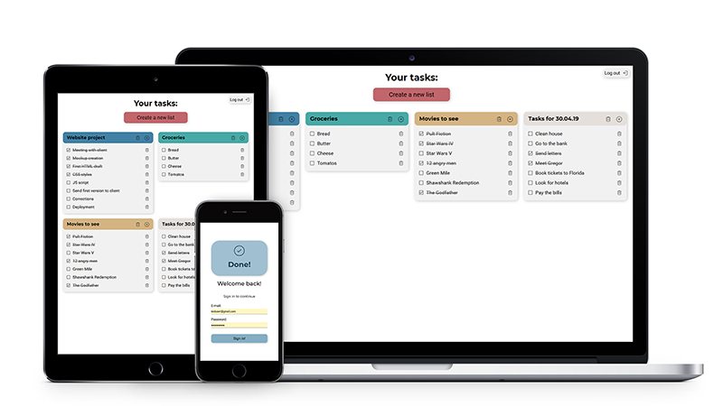
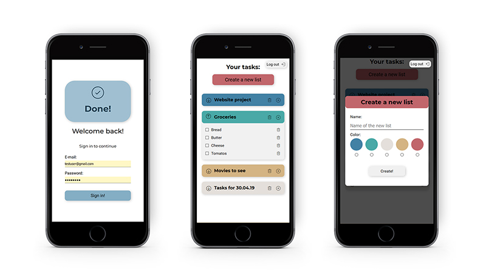

# CC3_ToDoApp
Simple webapp made for managing tasks. App was made during CodersCamp 2019 course.

## Table of contents
- [CC3_ToDoApp](#cc3todoapp)
  - [Table of contents](#table-of-contents)
  - [General info](#general-info)
  - [Technologies](#technologies)
  - [Setup](#setup)
  - [Features](#features)
  - [Screenshots](#screenshots)
  - [Authors](#authors)
  - [Credits](#credits)

## General info

Frontend:

Backend: 
The database is hosted in a cloud - MongoDB Atlas. It stores task lists, tasks and users of our app.
We used Express.js to create a sever and manage GET, POST, PUT, DELETE HTTP requests on tasks and task lists. 
User authentication is handled with bcrypt and jsonwebtoken libraries. In this demo version there is only one user in the database and there is no possibility to register a new one. User gets a cookie storing their JSON web token while they log in. The cookie is removed from the browser when user logs out. Each route, apart from /login, is protected with user authentication.

To log in, use the following credentials:

* email: testuser@gmail.com
* password: 345cthh2


## Technologies
* JavaScript
* CSS
* HTML
* Webpack
* Node.js
* Express.js
* MongoDB/mongoose
* Heroku
* JSON Web Token
* bcrypt.js

## Setup
The project requires Node.js installed.

```bash
npm install
npm run build
```
To run with Webpack Dev Server:
```bash
npm run start:dev
```

## Features


## Screenshots






## Authors
* https://github.com/KamilaCoder
* https://github.com/Aaspyr
* https://github.com/maciejkorolik
* https://github.com/MarcinCzajka

## Credits

* Icons by [Zwicon](https://www.zwicon.com/)

